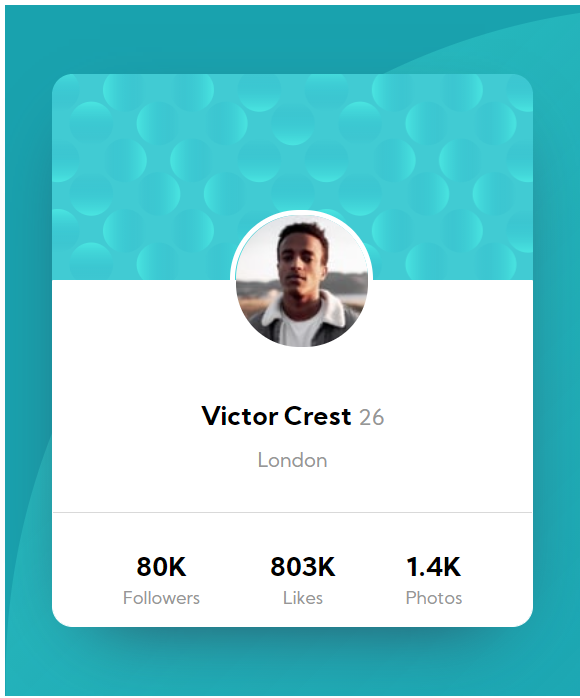

# Frontend Mentor - Profile card component solution

This is a solution to the [Profile card component challenge on Frontend Mentor](https://www.frontendmentor.io/challenges/profile-card-component-cfArpWshJ). Frontend Mentor challenges help you improve your coding skills by building realistic projects. 

## Table of contents

- [The challenge](#the-challenge)
- [Screenshot](#screenshot)
    - [Desktop](#desktop-view)
    - [Mobile](#Mobile-view)
- [Built with](#built-with)
- [Author](#author)

### The challenge

- Build out the project to the designs provided

### Screenshot

#### Desktop view

#### Mobile view

### Built with

- Semantic HTML5 markup
- Flexbox
- CSS Grid

## Author

- Frontend Mentor - [@sym28](https://www.frontendmentor.io/profile/sym28)